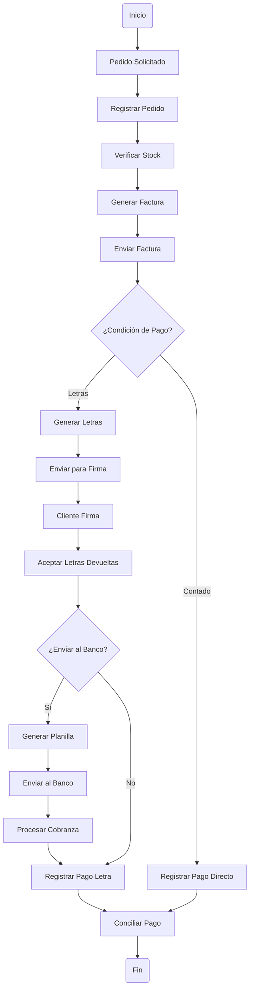
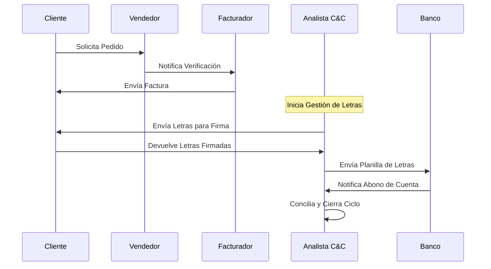
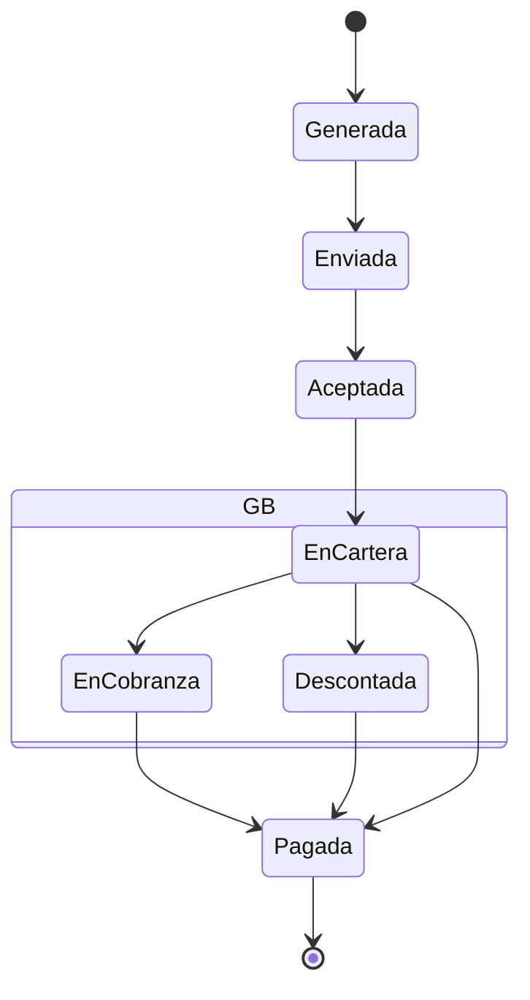

# INFORME DE PROYECTO: SISTEMA DE GESTIÓN Y REPORTE DE COBRANZAS (EFRS IV)

---

**INSTITUCIÓN:** CIBERTEC**CURSO:** Experiencias Formativas en Situaciones Reales de Trabajo IV (EFSRT)**PROYECTO:** Crunch-Debt: Automatización del Ciclo de Cobranzas**GRUPO:** [Insertar Número de Grupo]**INTEGRANTES:**

* MONTERO VILCAS JOSE GORGE
* FLORES SOTO JAIRO
* AVILA VILLAREAL JAMES

## ÍNDICE

1. [INTRODUCCIÓN](#introducción)
2. [CAPÍTULO 1. DIAGNÓSTICO DEL PROBLEMA](#capítulo-1-diagnóstico-del-problema)
   - 1.1. Diagnóstico situacional
   - 1.2. Análisis SWOT (FODA)
   - 1.3. Análisis SEPTE
   - 1.4. Justificación del Proyecto
3. [CAPÍTULO 2. DESCRIPCIÓN DEL PROYECTO](#capítulo-2-descripción-del-proyecto)
   - 2.1. Objetivos (General y Específicos)
   - 2.2. Alcance
   - 2.3. Ventaja comparativa
   - 2.4. Organización del Proyecto
   - 2.5. Beneficiarios
4. [CAPÍTULO 3. DESARROLLO DEL PROYECTO](#capítulo-3-desarrollo-del-proyecto)
   - 3.1. Arquitectura del Proyecto
   - 3.2. Diagramas de Proceso (Mermaid)
   - 3.3. Evaluación Tecnológica
5. [CONCLUSIONES](#conclusiones)
6. [RECOMENDACIONES](#recomendaciones)
7. [ANEXOS](#anexos)

---

## INTRODUCCIÓN

El presente proyecto, denominado **Crunch-Debt**, surge de la necesidad de optimizar y digitalizar el flujo de cobranzas en empresas con alto volumen de ventas al crédito y mediante letras. La falta de una herramienta centralizada genera retrasos en la conciliación y falta de trazabilidad, afectando la liquidez de la organización. Este informe detalla el ciclo desde la generación del pedido hasta la notificación de abono bancario.

---

## CAPÍTULO 1. DIAGNÓSTICO DEL PROBLEMA

### 1.1. Diagnóstico situacional

Actualmente, el proceso de cobranza depende de tareas manuales: el Analista de C&C debe generar planillas físicas o en hojas de cálculo para enviar al banco, y la conciliación de facturas pagadas contra letras se realiza de forma asíncrona, lo que genera errores en los estados de cuenta de los clientes.

### 1.2. Análisis SWOT (FODA)

* **Fortalezas:** Proceso de negocio ya definido y estructurado.
* **Oportunidades:** Existencia de APIs bancarias y tecnologías de automatización web.
* **Debilidades:** 95% de procesos manuales en la generación de planillas.
* **Amenazas:** Pérdida de documentos físicos (letras firmadas) y desactualización de saldos.

### 1.3. Análisis SEPTE

* **Social:** Mejora la relación con el cliente al evitar cobros indebidos.
* **Económico:** Mejora el flujo de caja mediante la reducción del Tiempo Promedio de Cobro (TPC).
* **Político/Legal:** Cumplimiento con las normativas de facturación electrónica y gestión de títulos valores (Letras).
* **Tecnológico:** Uso de arquitecturas Cloud y CI/CD para alta disponibilidad.

### 1.4. Justificación del Proyecto

El proyecto se justifica por la necesidad de reducir el margen de error humano en un 95% y asegurar que el 100% de las letras tengan trazabilidad en tiempo real, desde su emisión hasta su abono en cuenta bancaria.

---

## CAPÍTULO 2. DESCRIPCIÓN DEL PROYECTO

### 2.1. Objetivos

* **Objetivo General:** Desarrollar e implementar una plataforma web para la gestión integral del ciclo de ventas y cobranzas.
* **Objetivos Específicos:**
  * Reducir el Tiempo Promedio de Cobro (TPC) en un 15%.
  * Automatizar la generación de Planillas de Letras para envío bancario.
  * Centralizar la visualización de KPIs para la toma de decisiones financieras.

### 2.2. Alcance

El sistema cubrirá:

1. Registro y verificación de stock de pedidos.
2. Emisión y envío automático de facturas electrónicas.
3. Gestión de estados de Letras (Generada, Aceptada, En Cobranza, Pagada).
4. Generación de informes de gestión y KPIs.

### 2.3. Ventaja comparativa

A diferencia de sistemas contables genéricos, Crunch-Debt se especializa en la **trazabilidad de la letra física**, vinculando digitalmente la firma del cliente con la planilla bancaria y la conciliación automática.

### 2.4. Organización del Proyecto

Roles involucrados:

* **Vendedor:** Responsable del registro inicial.
* **Facturador:** Emisión de comprobantes.
* **Analista de Créditos y Cobranzas (C&C):** Gestor principal de letras y conciliación bancaria.

---

## CAPÍTULO 3. DESARROLLO DEL PROYECTO

### 3.1. Arquitectura del Proyecto

El sistema sigue una arquitectura moderna:

* **Frontend:** Aplicación Web Responsiva (Next.js/React).
* **Backend:** API RESTful para gestión de lógica de negocio.
* **Base de Datos:** PostgreSQL (Supabase) / MySQL para persistencia de datos.
* **Infraestructura:** Despliegue en Microsoft Azure.
* **CI/CD:** Pipelines automatizados mediante GitHub Actions.

### 3.2. Modelo de Datos (PostgreSQL)

A continuación se detalla el script original de creación de tablas:

```sql
-- =====================================================
-- SCHEMA DE GESTIÓN DE COBRANZAS
-- Basado en el documento de Investigación Aplicada
-- =====================================================

-- 1. TABLA DE VENDEDORES
CREATE TABLE IF NOT EXISTS public.vendedores (
  id UUID PRIMARY KEY DEFAULT gen_random_uuid(),
  codigo VARCHAR(20) UNIQUE NOT NULL,
  nombre VARCHAR(200) NOT NULL,
  email VARCHAR(100),
  telefono VARCHAR(20),
  activo BOOLEAN DEFAULT true,
  created_at TIMESTAMP WITH TIME ZONE DEFAULT now(),
  updated_at TIMESTAMP WITH TIME ZONE DEFAULT now()
);

-- 2. TABLA DE CLIENTES
CREATE TABLE IF NOT EXISTS public.clientes (
  id UUID PRIMARY KEY DEFAULT gen_random_uuid(),
  codigo VARCHAR(20) UNIQUE NOT NULL,
  razon_social VARCHAR(300) NOT NULL,
  ruc VARCHAR(11) UNIQUE NOT NULL,
  direccion TEXT,
  email VARCHAR(100),
  telefono VARCHAR(20),
  nivel_riesgo VARCHAR(10) CHECK (nivel_riesgo IN ('Bajo', 'Medio', 'Alto')) DEFAULT 'Medio',
  limite_credito DECIMAL(12,2) DEFAULT 0,
  activo BOOLEAN DEFAULT true,
  created_at TIMESTAMP WITH TIME ZONE DEFAULT now(),
  updated_at TIMESTAMP WITH TIME ZONE DEFAULT now()
);

-- (Resto del script incluido en Anexos para brevedad)
```

### 3.3. Diagramas de Proceso

A continuación, se presentan los flujos diseñados bajo el Proceso Unificado Ágil:

#### A. Diagrama de Actividades (BPMN)



#### B. Diagrama de Secuencia de Interacción



#### C. Diagrama de Estados: Letra por Pagar



---

## CONCLUSIONES

1. La implementación de Crunch-Debt permitirá eliminar la incertidumbre sobre el estado de las letras aceptadas.
2. La automatización de las planillas reducirá drásticamente el tiempo operativo del Analista de C&C.
3. El uso de tecnologías modernas (Azure, GitHub Actions) garantiza un tiempo de actividad superior al 99.9%.

---

## RECOMENDACIONES

1. Capacitar al personal de ventas en la verificación de condiciones previas a la facturación para evitar anulaciones.
2. Integrar el sistema con el API de SUNAT para la validación automática de comprobantes.
3. Evaluar la implementación de un módulo de cobranza coactiva para letras con más de 90 días de retraso.

---

## ANEXOS

* **Repositorio GitHub:** [GitHub Proyecto](https://github.com/Josesaso45/crunch-debt)
* **Script de Base de Datos Original (PostgreSQL):**

```sql
-- =====================================================
-- SCHEMA DE GESTIÓN DE COBRANZAS COMPLETE
-- =====================================================

-- 1. TABLA DE VENDEDORES
CREATE TABLE IF NOT EXISTS public.vendedores (
  id UUID PRIMARY KEY DEFAULT gen_random_uuid(),
  codigo VARCHAR(20) UNIQUE NOT NULL,
  nombre VARCHAR(200) NOT NULL,
  email VARCHAR(100),
  telefono VARCHAR(20),
  activo BOOLEAN DEFAULT true,
  created_at TIMESTAMP WITH TIME ZONE DEFAULT now(),
  updated_at TIMESTAMP WITH TIME ZONE DEFAULT now()
);

-- 2. TABLA DE CLIENTES
CREATE TABLE IF NOT EXISTS public.clientes (
  id UUID PRIMARY KEY DEFAULT gen_random_uuid(),
  codigo VARCHAR(20) UNIQUE NOT NULL,
  razon_social VARCHAR(300) NOT NULL,
  ruc VARCHAR(11) UNIQUE NOT NULL,
  direccion TEXT,
  email VARCHAR(100),
  telefono VARCHAR(20),
  nivel_riesgo VARCHAR(10) CHECK (nivel_riesgo IN ('Bajo', 'Medio', 'Alto')) DEFAULT 'Medio',
  limite_credito DECIMAL(12,2) DEFAULT 0,
  activo BOOLEAN DEFAULT true,
  created_at TIMESTAMP WITH TIME ZONE DEFAULT now(),
  updated_at TIMESTAMP WITH TIME ZONE DEFAULT now()
);

-- 3. TABLA DE ENTIDADES FINANCIERAS
CREATE TABLE IF NOT EXISTS public.entidades_financieras (
  id UUID PRIMARY KEY DEFAULT gen_random_uuid(),
  codigo VARCHAR(20) UNIQUE NOT NULL,
  nombre VARCHAR(200) NOT NULL,
  tipo VARCHAR(50), -- Banco, Financiera, etc.
  contacto VARCHAR(200),
  email VARCHAR(100),
  telefono VARCHAR(20),
  activo BOOLEAN DEFAULT true,
  created_at TIMESTAMP WITH TIME ZONE DEFAULT now(),
  updated_at TIMESTAMP WITH TIME ZONE DEFAULT now()
);

-- 4. TABLA DE PEDIDOS
CREATE TABLE IF NOT EXISTS public.pedidos (
  id UUID PRIMARY KEY DEFAULT gen_random_uuid(),
  numero VARCHAR(50) UNIQUE NOT NULL,
  fecha DATE NOT NULL,
  cliente_id UUID REFERENCES public.clientes(id) ON DELETE RESTRICT NOT NULL,
  vendedor_id UUID REFERENCES public.vendedores(id) ON DELETE RESTRICT NOT NULL,
  subtotal DECIMAL(12,2) NOT NULL DEFAULT 0,
  igv DECIMAL(12,2) NOT NULL DEFAULT 0,
  total DECIMAL(12,2) NOT NULL DEFAULT 0,
  condicion_pago VARCHAR(20) CHECK (condicion_pago IN ('Contado', 'Credito')) DEFAULT 'Contado',
  dias_credito INTEGER DEFAULT 0,
  estado VARCHAR(20) CHECK (estado IN ('Pendiente', 'Facturado', 'Anulado')) DEFAULT 'Pendiente',
  observaciones TEXT,
  created_at TIMESTAMP WITH TIME ZONE DEFAULT now(),
  updated_at TIMESTAMP WITH TIME ZONE DEFAULT now()
);

-- 5. TABLA DE FACTURAS
CREATE TABLE IF NOT EXISTS public.facturas (
  id UUID PRIMARY KEY DEFAULT gen_random_uuid(),
  numero VARCHAR(50) UNIQUE NOT NULL,
  serie VARCHAR(10) NOT NULL,
  fecha DATE NOT NULL,
  fecha_vencimiento DATE,
  pedido_id UUID REFERENCES public.pedidos(id) ON DELETE RESTRICT,
  cliente_id UUID REFERENCES public.clientes(id) ON DELETE RESTRICT NOT NULL,
  vendedor_id UUID REFERENCES public.vendedores(id) ON DELETE RESTRICT NOT NULL,
  subtotal DECIMAL(12,2) NOT NULL DEFAULT 0,
  igv DECIMAL(12,2) NOT NULL DEFAULT 0,
  total DECIMAL(12,2) NOT NULL DEFAULT 0,
  saldo_pendiente DECIMAL(12,2) NOT NULL DEFAULT 0,
  estado VARCHAR(20) CHECK (estado IN ('Pendiente', 'Pagada', 'Vencida', 'Anulada')) DEFAULT 'Pendiente',
  condicion_pago VARCHAR(20) CHECK (condicion_pago IN ('Contado', 'Credito')) DEFAULT 'Contado',
  moneda VARCHAR(3) DEFAULT 'PEN',
  observaciones TEXT,
  created_at TIMESTAMP WITH TIME ZONE DEFAULT now(),
  updated_at TIMESTAMP WITH TIME ZONE DEFAULT now()
);

-- 6. TABLA DE LETRAS POR PAGAR (Bills of Exchange)
CREATE TABLE IF NOT EXISTS public.letras (
  id UUID PRIMARY KEY DEFAULT gen_random_uuid(),
  numero_unico VARCHAR(50) UNIQUE NOT NULL,
  factura_id UUID REFERENCES public.facturas(id) ON DELETE RESTRICT NOT NULL,
  cliente_id UUID REFERENCES public.clientes(id) ON DELETE RESTRICT NOT NULL,
  entidad_financiera_id UUID REFERENCES public.entidades_financieras(id) ON DELETE SET NULL,
  importe DECIMAL(12,2) NOT NULL,
  fecha_emision DATE NOT NULL,
  fecha_vencimiento DATE NOT NULL,
  fecha_aceptacion DATE,
  fecha_descuento DATE,
  fecha_pago DATE,
  estado VARCHAR(30) CHECK (estado IN ('Generada', 'Enviada a Cliente', 'Aceptada', 'En Cartera', 'En Cobranza', 'Descontada', 'Pagada', 'Protestada')) DEFAULT 'Generada',
  tasa_descuento DECIMAL(5,2),
  monto_descuento DECIMAL(12,2),
  observaciones TEXT,
  created_at TIMESTAMP WITH TIME ZONE DEFAULT now(),
  updated_at TIMESTAMP WITH TIME ZONE DEFAULT now()
);

-- 7. TABLA DE PLANILLAS DE LETRAS
CREATE TABLE IF NOT EXISTS public.planillas_letras (
  id UUID PRIMARY KEY DEFAULT gen_random_uuid(),
  numero VARCHAR(50) UNIQUE NOT NULL,
  fecha_envio DATE NOT NULL,
  entidad_financiera_id UUID REFERENCES public.entidades_financieras(id) ON DELETE RESTRICT NOT NULL,
  total_letras INTEGER DEFAULT 0,
  importe_total DECIMAL(12,2) DEFAULT 0,
  estado VARCHAR(20) CHECK (estado IN ('Pendiente', 'Enviada', 'Recibida', 'Procesada')) DEFAULT 'Pendiente',
  observaciones TEXT,
  created_at TIMESTAMP WITH TIME ZONE DEFAULT now(),
  updated_at TIMESTAMP WITH TIME ZONE DEFAULT now()
);

-- 8. TABLA DE DETALLE DE PLANILLAS (Relación muchos a muchos)
CREATE TABLE IF NOT EXISTS public.planillas_letras_detalle (
  id UUID PRIMARY KEY DEFAULT gen_random_uuid(),
  planilla_id UUID REFERENCES public.planillas_letras(id) ON DELETE CASCADE NOT NULL,
  letra_id UUID REFERENCES public.letras(id) ON DELETE CASCADE NOT NULL,
  created_at TIMESTAMP WITH TIME ZONE DEFAULT now(),
  UNIQUE(planilla_id, letra_id)
);

-- 9. TABLA DE PAGOS
CREATE TABLE IF NOT EXISTS public.pagos (
  id UUID PRIMARY KEY DEFAULT gen_random_uuid(),
  numero VARCHAR(50) UNIQUE NOT NULL,
  fecha DATE NOT NULL,
  cliente_id UUID REFERENCES public.clientes(id) ON DELETE RESTRICT NOT NULL,
  factura_id UUID REFERENCES public.facturas(id) ON DELETE RESTRICT,
  letra_id UUID REFERENCES public.letras(id) ON DELETE RESTRICT,
  monto DECIMAL(12,2) NOT NULL,
  metodo_pago VARCHAR(30) CHECK (metodo_pago IN ('Efectivo', 'Transferencia', 'Cheque', 'Letra', 'Otro')) DEFAULT 'Transferencia',
  numero_operacion VARCHAR(100),
  banco VARCHAR(100),
  estado VARCHAR(20) CHECK (estado IN ('Pendiente', 'Confirmado', 'Conciliado', 'Anulado')) DEFAULT 'Pendiente',
  observaciones TEXT,
  created_at TIMESTAMP WITH TIME ZONE DEFAULT now(),
  updated_at TIMESTAMP WITH TIME ZONE DEFAULT now()
);
```

* **Plan de Proyecto original:** `Referencia de documentacion/Plan de proyecto.pdf`

---

**CIBERTEC - Informe de Proyecto EFSRT IV**
*Crunch-Debt Team*
